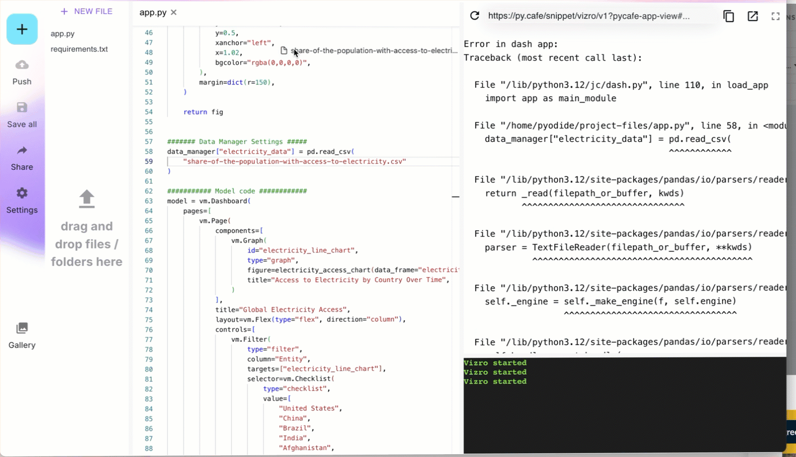

# How to use local or remote data

You can ask the LLM to create specific dashboards based on local or remote data if you already have an idea of what you want.

## Local data

You can upload a file of local data to the prompt or direct the prompt to the path for the data.

### How to set up PyCafe to access your local data

If you use PyCafe to review your dashboard or to share it to others, you will need to provide it with your data. One option is to upload it, for example to GitHub, so that PyCafe can access it from a public link. Alternatively, you can share the data directly to the PyCafe project as shown below.

!!! Tip "Do not share private data!"

    If your data is private and cannot be uploaded to PyCafe or the internet, you can ask Vizro-MCP to save the dashboard code into a `.py` file, and run it locally to access the data.

## Remote data

Example prompts for using remote data could be:

> _Create a Vizro dashboard with one page, a scatter chart, and a filter based on `<insert absolute file path or public URL>` data._

> _Create a simple two page Vizro dashboard, with first page being a correlation analysis of `<insert absolute file path or public URL>` data, and the second page being a map plot of `<insert absolute file path or public URL>` data_

You can find a set of sample CSVs to try out in the [Plotly repository](https://github.com/plotly/datasets/tree/master).

You can even ask for dashboard code without providing data:

> _Create a Vizro dashboard with one page, a scatter chart, and a filter._

In general, it helps to specify Vizro in the prompt and to keep it as precise (and simple) as possible.
