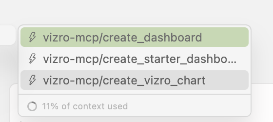

# How to use Vizro-MCP prompt templates

!!! warning "Check if the templates are available for your MCP host"

    Vizro-MCP's prompt templates are available in Claude Desktop and Cursor, but may not allowed by other MCP hosts.

You can use the prompt templates to create specific dashboards quickly.

In Claude Desktop, click on the plus icon below the chat, and choose _`Add from vizro-mcp`_.

In Cursor, access the prompt templates by typing `/` into the prompt, which will bring up a list of prompts available:

The templates available currently are as follows:

- **`create_dashboard`** Create a dashboard based on a local or remote dataset.

- **`create_starter_dashboard`** Get started with an example Vizro dashboard.

- **`create_vizro_chart`** Create a Vizro styled Plotly chart based on a local or remote dataset.
