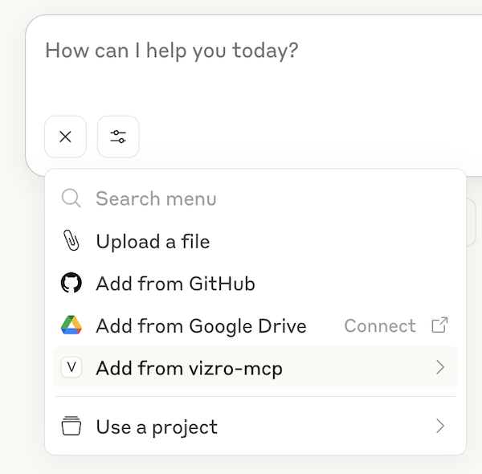

# How to use Vizro-MCP prompt templates

!!! warning "Check if the templates are available for your MCP host"

    Vizro-MCP's prompt templates are available in Claude Desktop, but may not allowed by other MCP hosts.

You can use the prompt templates to create specific dashboards quickly. In Claude Desktop, click on the plus icon below the chat, and choose _`Add from vizro-mcp`_.

The templates available currently as as follows:

- `create_dashboard` - Use this prompt template to create a dashboard based on a local or remote CSV dataset.

- `create_starter_dashboard` - Use this prompt template to get started with Vizro dashboards.

- `create_vizro_chart` - Use this prompt template to create a Vizro styled Plotly chart based on a local or remote CSV dataset.
