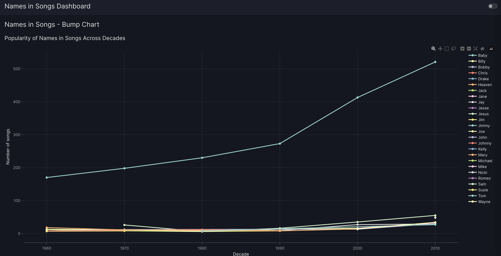
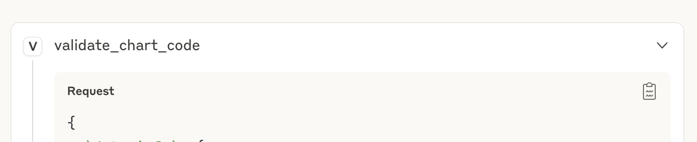
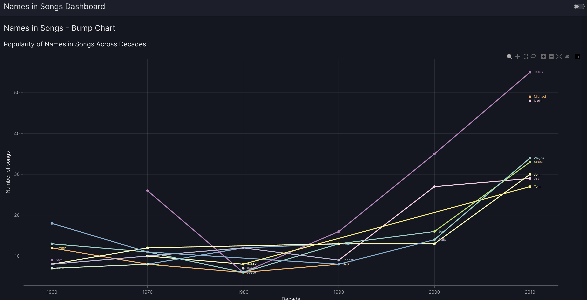
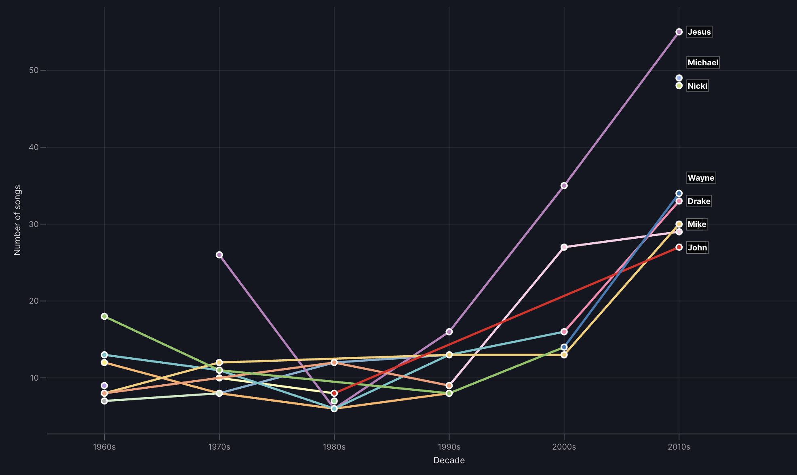
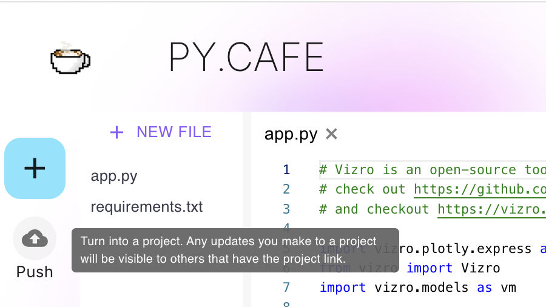
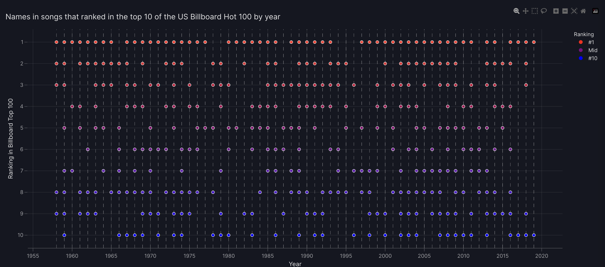
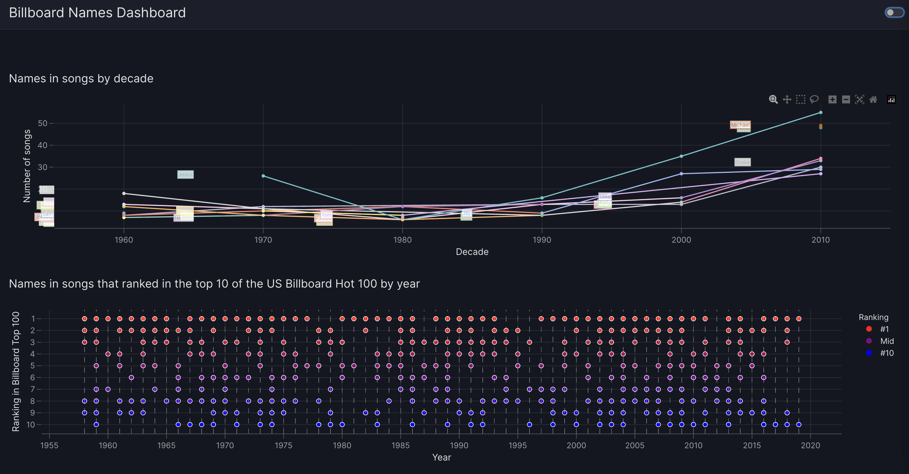
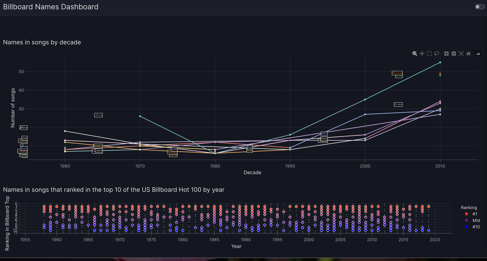

# Claude Desktop and Vizro-MCP tutorial

## About this tutorial

This tutorial uses a public dataset of [names in songs](https://github.com/the-pudding/data/tree/master/names-in-songs) from [The Pudding](https://pudding.cool/), which was used in a [story about the names that occur in popular songs](https://pudding.cool/2019/05/names-in-songs/).

We will pass links to this data to Vizro-MCP to create a Vizro dashboard with two charts.

## Set up Vizro-MCP

Before creating a Vizro dashboard with Vizro-MCP, you need to configure your MCP host. Follow our instructions to [set up Claude Desktop](../guides/set-up-vizro-mcp-with-claude.md), which is what this tutorial assumes you will work with.

(Alternatively, you can [set up Cursor](../guides/set-up-vizro-mcp-with-cursor.md), or [set up VS Code](../guides/set-up-vizro-mcp-with-vscode.md), or use our [basic setup configuration](../guides/set-up-vizro-mcp-basics.md) for your preferred host).

When Claude Desktop is set up to use Vizro-MCP, you should see the vizro-mcp menu in the settings/context menu:


## Strategy

There is no single, correct way to use Vizro-MCP. You will find your own preferred way of entering prompts and iterating on the results. You can ask Claude to create a single Vizro chart (this takes the shortest processing time) or you can ask it to create a Vizro dashboard and display one or more charts.

In this tutorial, we first create a Vizro chart by passing a simple prompt to Claude. We then learn how to improve the output with feedback prompts, and refine the chart code in a series of iterations.

To illustrate an alternative approach to chart creation, we then create a separate, second chart starting with a more complex prompt.

Finally, we ask Claude to build a dashboard containing both charts and give feedback to iterate the output.

## Create a chart with a simple prompt

We will start by using the [timeless_names.csv](https://github.com/the-pudding/data/blob/master/names-in-songs/timeless_names.csv) data, which captures the 10 names most commonly occurring in songs for each decade between 1960s and 2010s. We will remove the rows where the person is FALSE, since these are where it is uncertain if the name refers to a person or to something else, such as a brand (for example "Calvin Klein"), month (for example, "April"), season (for example, "Summer"), and so on.

Submit this prompt to Claude Desktop, or your preferred host.

```text
Use this data https://github.com/the-pudding/data/blob/master/names-in-songs/timeless_names.csv and preprocess it to remove all rows where person==FALSE.

Use Vizro-MCP and your knowledge of Vizro and Plotly to create a single bump chart.

On the x axis, use decade: 1960, 1970, 1980 etc. Label the axis "Decade"
On the y axis, use the value of n for each name for each decade.
The label on the y axis should be "Number of songs".

The lines that link points should be for each name across each of the
decades for that name. Use a unique color for each name.
```

When the LLM is ready, it opens an instance of [PyCafe](https://py.cafe/) and displays the chart in a Vizro dashboard. The exact result depends on the LLM and what you receive may vary. This is one possible output:



!!! Tip "PyCafe cannot display charts that use local data"

    Vizro-MCP can only show your chart or dashboard in PyCafe if the data it consumes can be downloaded from a public link. If you use local data, you should copy the generated chart or dashboard code into a `.py` file to run locally, so it can access the data.

## Iterate the chart

You'll notice a few issues with the chart created, so now is the time to iterate:

- The name "Baby" is creating a scaling issue. While it is considered a real name, it's most likely to be used as an affectionate term, and there is no easy way to separate the usage. We will add to the prompt to filter it out.
- The legend of different colors isn't very usable: it would be better to label each line and include hover text that pops up for each point on the line.

It is often easier to stay in the same chat to keep context when you submit a new prompt to Claude Desktop. If for some reason you want to iterate on the chart in another chat context, you can paste in the output from the previous chart creation prompt. Copy the `validate_chart_code` configuration by clicking on the clipboard icon and paste it into the prompt:



```text
This is good, but let's revise the chart to remove the legend.

Instead label each line with the name in question.

Add hover text for each point that includes:
* name,
* n (which you should label as number of songs),
* decade.

Also, when working with the data from now on:
remove all rows where person==FALSE and all rows where name==Baby.
```

From the prompt iteration, Claude generated this chart, shown in PyCafe:



The result has a much better scale and the labeling is helpful but it's not perfect. We can ask again to improve it, either in the same chat or by commenting on the configuration output with the chart:

```text
Almost there! Pay attention to the labels.
Be sure that they don't overlap the lines and are readable.

Start them where possible to the left of the first point
at which the name appears on the chart.

You can ask Vizro to increase the font size if needed.
```

The prompt iteration generates this output, although your version may be slightly different:



The exact positioning of the label seems to be difficult to achieve, and in part this is expected when working with Plotly. You may need to iterate a few times to get the exact placement, or you may find other issues crop up, since that is the nature of using a non-deterministic model.

When you are happy with your version, it is a good idea to copy the output and save it to GitHub, in case you need it in future. You may also want to convert the PyCafe code to save it as a public project, using the Push button:



If Vizro-MCP is not improving your chart after a few iterations of the same request, or appears to be struggling, it may be worth prompting it to validate the output. Do this by saying "Don't forget to validate" at the end of any prompt to remind it.

## Create a chart with a complex prompt

We'll now add another chart to the Vizro dashboard. This will show names found in songs that made it to the top 10 of the Billboard Hot 100 between 1958 and 2019. The chart will show each year, and use colors to show the song's ranking.

```text
Use https://raw.githubusercontent.com/the-pudding/data/master/names-in-songs/unique.csv and preprocess the data to remove all rows where person==FALSE and all rows where name==Baby. Remove any null values.

Create a single chart which is a scatter plot with year ascending on the x axis.

Show the names that scored 1-10 in highestRank for that year on the y axis.

Put the highestRank == 10 at the bottom and highestRank==1 at the top.

Mark the y axis as “Ranking in Billboard Top 100” and each point
should have a rollover to show the name, artist and song only.

Use red/blue color-coding by ranking with inverted color scale
(lower numbers are better ranks and should be the warmer red colors).

Add vertical dashed year lines and a colorbar to show "#1", "Mid", "#10" labels.

Title of this chart:
"Names in songs that ranked in the top 10 of the US Billboard Hot 100 by year."
```

This is a wordy prompt, which generated the following output on the first attempt. You may want to use a detailed prompt on your first approach, but you may alternatively prefer to build up a chart in steps, starting with fewer, simple instructions. There is no right way to work with Vizro-MCP, and you'll find different approaches work for different chart types too.



## Create a dashboard

The next step is to combine both charts as a single dashboard. This prompt adds the bump chart to a chat which has the context of scatter chart created above:

```text
Create a Vizro dashboard which shows this scatter chart and adds another chart above this one.

To create the second chart, use this data https://github.com/the-pudding/data/blob/master/names-in-songs/timeless_names.csv.

Preprocess it to remove all rows where person==FALSE, and all rows where name==Baby.

Use Vizro-MCP and your knowledge of Vizro and Plotly to add a bump chart to the dashboard.

On the x axis, use decade: 1960, 1970, 1980 etc. Label the axis "Decade"

On the y axis, use the value of n for each name for each decade.

The label on the y axis should be "Number of songs".

The lines that link points should be for each name
across each of the decades for that name.

Use a unique color for each name.

Don't include a legend but label each line with the name in question.

Add hover text for each point that includes:
* name,
* n (which you should label as number of songs),
* decade.

Pay attention to the labels and be sure that they don't
overlap the lines and are readable.

Start them where possible to the left of the first point
at which the name appears on the chart.
You can ask Vizro to increase the font size if needed.

```

A further iteration:

```text
On the dashboard, remove the text "Names in Billboard Songs Analysis".
Replace "Names in Songs by Decade" with "Names in songs by decade"
Tidy the chart to avoid the labels overwriting each other or the lines.
```



A further set of changes:

```text
On the dashboard, make the top chart double height.
Try the name labels in a dark theme so use black rectangles
with colored text and white outline.
On the bottom chart, add artist to the hovertext for each point.
```



## Save the prompt for your dashboard

When you are happy with the dashboard, you can store the code, for example, in GitHub. Copy the code from the PyCafe project, or click on the clipboard icon of the `validate_dashboard_config` section to copy the contents. You can also ask Claude to give you a prompt to store alongside the configuration.

```text
Can you give me the prompt that would work best
to regenerate the dashboard and charts above?
```

The following was returned:

```text
Create a Vizro dashboard with two charts using the following data sources:

1. https://raw.githubusercontent.com/the-pudding/data/master/names-in-songs/timeless_names.csv
2. https://raw.githubusercontent.com/the-pudding/data/master/names-in-songs/unique.csv

For both datasets, preprocess by removing all rows
where person==FALSE and all rows where name=="Baby".
Remove any null values.

**Chart 1 (Top): Bump Chart**
- Use timeless_names.csv data
- X-axis: decade (1960, 1970, 1980, etc.) labeled "Decade"
- Y-axis: value of 'n' for each name, labeled "Number of songs"
- Lines connecting points for each name across decades
- Unique color for each name (no legend)
- Labels for each line positioned to the left of the first data point
- Use dark theme styling for labels:
  black rectangles with colored text and white outline
- Hover text showing: name, number of songs, and decade
- Title: "Names in songs by decade"

**Chart 2 (Bottom): Scatter Plot**
- Use unique.csv data, filter to only top 10 rankings (highestRank 1-10)
- X-axis: year (ascending) with vertical dashed gridlines, labeled "Year"
- Y-axis: highestRank (inverted: rank 1 at top, rank 10 at bottom),
  labeled "Ranking in Billboard Top 100"
- Red-to-blue color gradient (inverted scale: rank 1 = red, rank 10 = blue)
- Hover text showing: name, artist, and song
- Legend showing "#1", "Mid", "#10" color reference
- Title: "Names in songs that ranked in the top
  10 of the US Billboard Hot 100 by year"

**Dashboard Settings:**
- Dashboard title: "Billboard Names Dashboard"
- No page title
- Bump chart positioned above scatter plot
- Use Vizro design system
```

## Share your dashboard

You should now be familiar with the process of iterating prompts in Claude Desktop to generate Vizro charts and a dashboard that are displayed by PyCafe. You also learned how Vizro-MCP generates Python code, and outputs dashboard configuration that can be stored in a change management system to be shared or reused in the future.

To share charts or dashboards generated by Vizro-MCP, you can use the **Share** options for the PyCafe project:

- **Project**: generates a link to share to a recipient, who can then see the code and dashboard
- **App**: is also a link, but this displays only the dashboard visualization without the code.
- **Export**: enables you to download the complete dashboard as a standalone HTML file, which can be shared or stored for reuse.
- **Embed**: builds an `iFrame` which contains all the code for the dashboard.
- **Code**: provides the dashboard code with Markdown and HTML formatting.


## Summary

Congratulations! You have seen how to work with Vizro-MCP and Claude Desktop to build a Vizro dashboard. You've seen how to iterate prompts, store the dashboard configuration and code, and share the visualization. The dashboard is a simple example with two basic charts but can be customized with additional charts, controls or customizations as described in the [Vizro documentation](https://vizro.readthedocs.io/en/stable/).

To learn more about the main elements of Vizro dashboard code, we recommend you work through the introductory ["Explore Vizro" tutorial](https://vizro.readthedocs.io/en/stable/pages/tutorials/explore-components/). The tutorial, and accompanying video, will enable you to explore the dashboard code generated by Vizro-MCP and give you ideas of how to modify it by hand rather than through a prompt.
