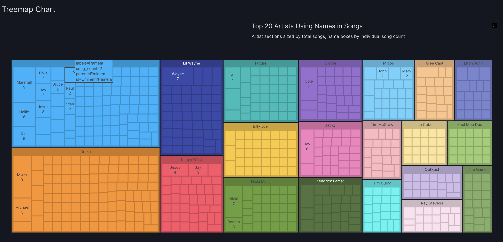
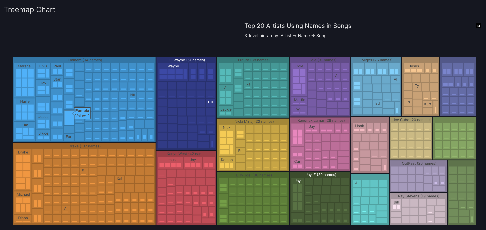
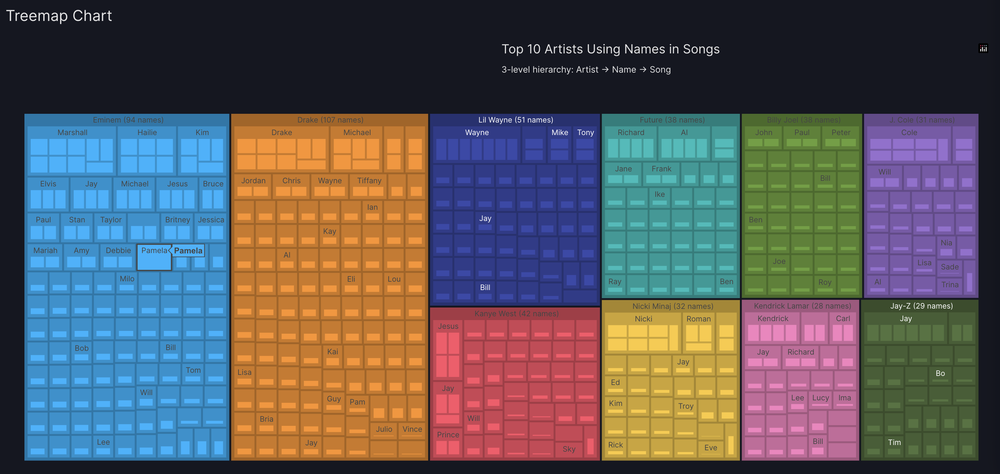
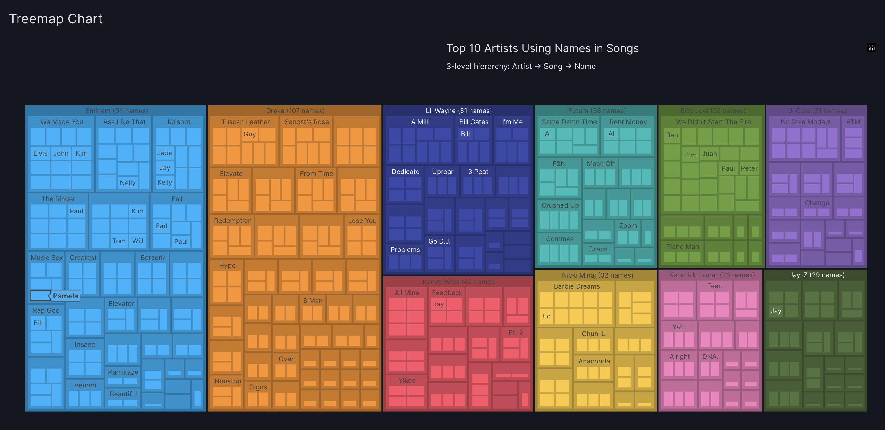

# Cursor and Vizro-MCP tutorial

## About this tutorial

This tutorial uses a public dataset of [names in songs](https://github.com/the-pudding/data/tree/master/names-in-songs) from [The Pudding](https://pudding.cool/), which was used in a [story about the names that occur in popular songs](https://pudding.cool/2019/05/names-in-songs/).

We will pass links to this data to Vizro-MCP running in Cursor to create a single Vizro chart.

## Set up Vizro-MCP

Before creating a Vizro dashboard with Vizro-MCP, you need to configure your MCP host. Follow our instructions to [set up Cursor](../guides/set-up-vizro-mcp-with-cursor.md), which is what this tutorial assumes you will work with.

(Alternatively, you can [set up Claude Desktop](../guides/set-up-vizro-mcp-with-claude.md), or [set up VS Code](../guides/set-up-vizro-mcp-with-vscode.md), or use our [basic setup configuration](../guides/set-up-vizro-mcp-basics.md) for your preferred host).

To check that Cursor is correctly set up to use Vizro-MCP, pass in a prompt:

> Can you access Vizro-MCP?

The response received should be similar to the following:

Yes! I do have access to Vizro-MCP tools. I can see several Vizro MCP functions available that allow me to help you create charts and dashboards using Vizro.
Here's what I can do with Vizro-MCP:

**Available Vizro-MCP Capabilities:**

1. Get chart/dashboard creation plans - Get instructions for creating Vizro charts or dashboards <br/>
1. Access model schemas - Get JSON schemas for Vizro models (like Card, Dashboard, Page) <br/>
1. Work with sample data - Access sample datasets (iris, tips, stocks, gapminder) <br/>
1. Analyze your data - Load and analyze data files (CSV, JSON, Excel, Parquet, etc.) <br/>
1. Validate configurations - Validate Vizro dashboard configurations and generate Python code <br/>
1. Validate custom charts - Validate custom chart code with PyCafe integration <br/>

## Strategy

There is no single, correct way to use Vizro-MCP. You will find your own preferred way of entering prompts and giving feedback on the results, and this will also depend on the underlying LLM that you have chosen. 

In this tutorial, you'll learn how to create a Vizro chart by passing a simple prompt to Cursor and then iterating upon it. We'll show the exact prompts and chart output we received to illustrate the process.

If you have a preferred workflow for Cursor, you can continue to use that. In the following tutorial, we prompted Cursor to start with an empty, clear workspace, and instructed it regularly to use Vizro-MCP tools for chart generation, since it sometimes needed help to stay on track. We also request it to open generated chart code in PyCafe for evaluation.

## Initial prompt

We are going to ask Cursor to create a treemap chart that shows the hierarchy of artists who have created the most songs with names in them. We ask Cursor to do some basic pre-processing of the data before using it, to eliminate usage of words that are probably not intended to be names. Here is the initial prompt for use with `claude-4-sonnet`:

> Hi, I want you to clear out the workspace. Then use Vizro-MCP tools with auto_open=true so you can open the code you generate for me directly in pycafe.
> 
> I would like you to create a single Vizro chart. Use https://raw.githubusercontent.com/the-pudding/data/master/names-in-songs/unique.csv and preprocess the data to remove all rows where person==FALSE and all rows where name==Baby. Remove any null values. I would like you to identify the artists that use the most different names in their songs. Find the top 20 artists. Plot a treemap which shows each artist and sizes their boxes according to the number of different names they've used. For each artist, in the treemap, show separate boxes for each name, and size them according to the number of different songs that artist has used that name.

Cursor will run and may ask you permission to run `get_vizro_chart_or_dashboard_plan`, which you should accept by clicking `Run tool`. Similarly accept any other steps that Cursor suggests.


 

When Cursor is satisfied that the configuration is valid, it opens an instance of [PyCafe](https://py.cafe/) and displays the code and Vizro visualization. The exact result depends on the LLM and what you receive may vary. 



!!! Tip "PyCafe cannot display charts that use local data"

    PyCafe will only open if your chart or dashboard uses data that can be downloaded from a public link. If your data is stored locally, you should copy the generated code into a `.py` file to run where it can access the data.


You can now prompt Cursor to make some improvements as needed. Some of the iteration prompts we used are included below to give you examples of how to request changes. We also prompted to resize the graphic to the viewport, and to hide the labels on the navigation bars.


## Iterate to improve labels

> It's looking good. I'd like to change the labels now. For each of the 20 boxes at the top of the hierarchy I'd like to see the number of names used in brackets. So for example 'Ray Stevens (20 names)'. The hovertext should just show artist and songcount, don't show parent and id. At the next level of hierarchy, I'd like to see each name on the box where it fits and the hovertext should show name and songcount (don't show parent and id). Can you go to another level of hierarchy and show boxes for each of the songs for each name? 



## Iterate to reduce artist count

At this point, the chart is looking close to complete, but it's clear that 20 artists are too many to make it usable. We can prompt to reduce that and have added another minor change request:

> Let's cut down on the number of artists to make it easier to fit in. Let's just do the top 10 artists. Can you remove the Value field from all the labels too, as I don't want to see that.



## Iterate to change the hierarchy

Looking at the chart, we could get more interesting information by changing the hierarchy of the treemap:

> Let's experiment by changing the hierarchy slightly. Can you now show Artist -> Song -> Name count instead of Artist -> Name -> Song. So you show the same 10 artists but the boxes in their names are the different songs they've released that contain names. And the boxes in those songs are the different names.



## Iterate to add the lyrics

We can use another column from the dataset to make the chart more informative:

> For each name in the lowest level of the hierarchy, can you add the sentence in which it is found by taking it from the data. Add it to the hovertext for each name box. 


## Save the prompt for your dashboard

When you are happy with the dashboard, you can store the code, for example, in GitHub. Copy the code from the PyCafe project or `app.py` if Cursor is iterating the code in a workspace. You can also ask Cursor to give you a prompt to store alongside the configuration.

```text
Can you give me the prompt that would work best
to regenerate the dashboard and charts above?
```

This is the output:

> Here's the comprehensive prompt that would have built this entire chart in one go:
> 
> I want you to create a single Vizro chart using Vizro-MCP tools that opens directly in PyCafe. Please:

> 1. **Clear the workspace completely** - remove all existing files <br/>
1. **Use Vizro-MCP tools** with `auto_open=true` to open the generated code directly in PyCafe <br/>
1. **Create a treemap visualization** using this dataset: `https://raw.githubusercontent.com/the-pudding/data/master/names-in-songs/unique.csv` <br/>

> **Data Preprocessing Requirements:** <br/>
- Remove all rows where `person == False` <br/>
- Remove all rows where `name == "Baby"` <br/>
- Remove any null values <br/>
- Find the top 10 artists who use the most different names in their songs <br/>

> **Chart Structure:** <br/>
- **Hierarchy**: Artist → Song → Name (3 levels) <br/>
- **Artist level**: Show artist name with count of unique names in brackets, e.g., "Drake (107 names)" <br/>
- **Song level**: Individual songs by each artist, sized by number of names in that song <br/>
- **Name level**: Individual names within each song, sized by frequency of that name in the song <br/>

> **Visual Requirements:** <br/>
- **Space filling**: Ensure boxes completely fill their containing areas with no empty spaces <br/>
- **Hover functionality**:  <br/>
  - Artist level: Show artist info, song count, and total unique names <br/>
  - Song level: Show song title and number of names in that song <br/>
  - Name level: Show the actual sentence from the lyrics where that name appears <br/>
- **No navigation breadcrumbs**: Hide the pathbar completely to avoid hover text issues <br/>
- **Viewport fitting**: Set height to 600px with autosize width to fit the browser viewport <br/>


> **Final Output:** <br/>
- A working treemap that opens in PyCafe <br/>
- Clean, professional appearance with proper spacing <br/>
- Interactive exploration through clicking (no navigation bar) <br/>
- Informative hover text at all levels <br/>
- Proper viewport sizing without scrolling issues <br/>

> Please use Vizro-MCP tools throughout the process and ensure the chart opens directly in PyCafe with `auto_open=true`.

## Share your dashboard

You should now be familiar with the process of iterating prompts in Cursor to generate a Vizro chart, and review it in PyCafe. Use the Share options in PyCafe to share finished charts or dashboard projects


- **Project**: generates a link to share to a recipient, who can then see the code and dashboard [as illustrated by this example](https://py.cafe/stichbury/vizro-artists-songs-names-treemap).
- **App**: is also a link, but this displays only the dashboard visualization without the code [as illustrated by this example](https://py.cafe/app/stichbury/vizro-artists-songs-names-treemap).
- **Export**: enables you to download the complete dashboard as a standalone HTML file, which can be shared or stored for reuse [as illustrated by this example](./vizro-artists-songs-names-treemap.html).
- **Embed**: builds an `iFrame` which contains all the code for the dashboard.
- **Code**: provides the dashboard code with Markdown and HTML formatting.


## Summary

Congratulations! You have seen how to work with Vizro-MCP and Cursor to build a Vizro chart. The chart is a simple example, but can be customized or added to a dashboard alongside additional charts, controls or customizations, as described in the [Vizro documentation](https://vizro.readthedocs.io/en/stable/).

To learn more about the main elements of Vizro dashboard code, we recommend you work through the introductory ["Explore Vizro" tutorial](https://vizro.readthedocs.io/en/stable/pages/tutorials/explore-components/). The tutorial, and accompanying video, will enable you to explore the dashboard code generated by Vizro-MCP and give you ideas of how to modify it by hand rather than through a prompt, should you prefer to fine tune it.
   


