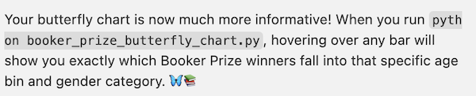
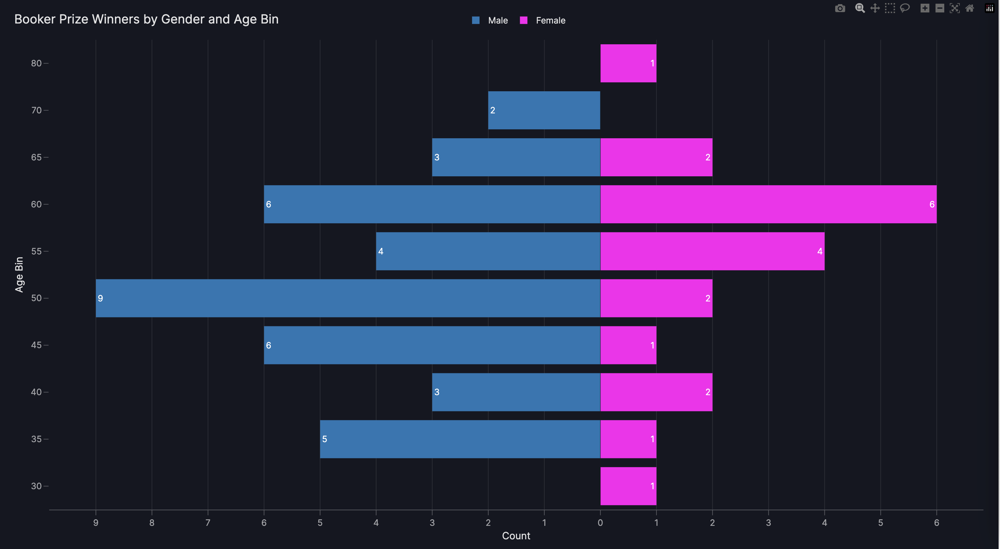

# Cursor and Vizro-MCP tutorial

## About this tutorial

This tutorial uses a public dataset about winners of the [Booker prize](https://thebookerprizes.com/booker-prize/about-the-booker-prize), which is a literary award conferred each year for the "best sustained work of fiction written in English and published in the UK and Ireland".

To work through the tutorial, you'll need to download the `.xlsx` dataset of [Booker prize winners from 1969 to 2023](https://www.kaggle.com/datasets/rowrowrowyourboat72/booker-prize-winners-1969-2023?resource=download) from Kaggle. The tutorial illustrates how to work with the data locally.

The tutorial uses Cursor as the MCP host, but if you prefer to use Microsoft VS Code, you can also follow the instructions since the environments are very similar.

The tutorial uses the host to generate an initial set of Python chart code, runs it to inspect the chart, then modifies the code by hand. The prompts and chart output at the time of writing are shown to illustrate the process. The nature of working with an LLM is that your output may be slightly different.

## Set up Vizro-MCP

If you haven't already done so, follow our instructions to [set up Vizro-MCP to work with Cursor](../guides/set-up-vizro-mcp-with-cursor.md), which this tutorial uses. Follow the instructions to [set up Vizro-MCP with Microsoft VS Code](../guides/set-up-vizro-mcp-with-vscode.md) if you prefer to use that host, or use our [basic setup configuration](../guides/set-up-vizro-mcp-basics.md) for your preferred host.

To check that your host is correctly set up to use Vizro-MCP, pass in a prompt:

```text
Can you access Vizro-MCP?
```

You should receive a response similar to the following:

> Yes! I do have access to Vizro-MCP tools. I can see several Vizro MCP functions available that allow me to help you create charts and dashboards using Vizro.

## Strategy

There is no single correct way to use Vizro-MCP, and the style of interaction also depends on the underlying LLM that you have chosen. Assuming you are using Cursor, select **Open Folder** from the **File** menu. Navigate to the folder you've stored the data, which is where you'll create Vizro code to visualize it.

## Prompt to generate a Vizro chart

As a first prompt, type something similar to the following:

```text
Use Vizro-MCP to build a butterfly chart for the
Booker Prize Dataset Final.xlsx using GENDER
(M on left hand side, F on right hand side),
with the count of each gender for each AGE BIN.
```

Here is the prompt as it was typed. Before you submit it, we recommend you check that the model selected is **`claude-4-sonnet`** and the mode is **Agent**:


Running this prompt in Cursor, we saw the following response. You should see something similar:


### Save the code

Ask Cursor to save the code into a `.py` file. For convenience, save it in the same directory as the data:

```text
Can you save the code into a .py file in this folder
as booker_prize_butterfly_chart.py?
```

### Execute the code

Open a new terminal within Cursor from the **Terminal** menu and navigate to the code and data directory within it. Create a new virtual environment to run the Vizro code, and install the necessary dependencies. In the below, we use the [uv package manager](https://docs.astral.sh/uv/):

```bash
uv venv cursorenv
source cursorenv/bin/activate
uv pip install pandas
uv pip install openpyxl
uv pip install vizro
```

Next, if the final line of code (`fig.show()`) is commented out, uncomment it so the chart is displayed, and save the code change.

In the terminal, type the following to execute the code:

```bash
python booker_prize_butterfly_chart.py
```

The output we received was as follows:


## Code iteration by hand

At first sight, the butterfly chart is already almost complete, but in the code we received, there was a missing line that meant that the number of women in each age bin was missing. It is possible to ask Cursor to make a fix, but it is a trivial change to make manually.

We added this line in the `fig.add_trace()` call (see a [later section for the complete code](#final-chart-code)).

```python
text = [abs(val) for val in female_values]
```

Executing the chart again, we received the following:


## Code iteration by prompt

We can now modify the code again, but since this is a more complex change, we can ask Cursor to do it:

```text
Can you change the hovertext on each bar to list
each WINNER and NOVEL that falls into that bin?
```

When we submitted the prompt, Cursor spent some time working through the changes, and finally returned this information:



Re-running the code showed the following:


## Final iteration

The chart is looking great. We can make a final tweak to change the color of the female bin to make it pink (hex code #ff0eef). Change the `marker_color` specification (for us, in line 107), and save the code, then re-run it. Our result was as follows:



The chart is complete!

## Final chart code

When you are happy with the chart, you can store the code, for example, in GitHub. Here it is for reference:

??? example "The final code for the completed chart."

    === "booker_prize_butterfly_chart.py"

    ```python linenums="1"

    	"""
    	Booker Prize Gender Butterfly Chart
    	===================================

    	A butterfly chart showing Booker Prize winners by gender and age bin.
    	Males are displayed on the left side, females on the right side.
    	Hover over bars to see detailed information including winner names and novel titles.

    	Created using Vizro-MCP
    	"""

    	import pandas as pd
    	import plotly.graph_objects as go
    	from vizro import Vizro
    	from vizro.models import Dashboard, Page, Card
    	from vizro.models.types import capture


    	@capture('graph')
    	def booker_prize_gender_butterfly(data_frame):
    	    """
    	    Creates a butterfly chart showing Booker Prize winners by gender and age bin.
    	    Hover text displays detailed information including winner names and novel titles.

    	    Args:
    	        data_frame (pd.DataFrame): DataFrame containing Booker Prize data with
    	                                  'GENDER', 'AGE BIN', 'WINNER', and 'NOVEL' columns

    	    Returns:
    	        plotly.graph_objects.Figure: Butterfly chart figure with detailed hover information
    	    """
    	    # Filter out rows with missing gender or age bin data
    	    df_clean = data_frame.dropna(subset=['GENDER', 'AGE BIN'])

    	    # Get all unique age bins and sort them
    	    all_age_bins = sorted(df_clean['AGE BIN'].unique())

    	    # Create dictionaries to store winners and novels for each gender/age bin combination
    	    male_data = {}
    	    female_data = {}

    	    for age_bin in all_age_bins:
    	        # Get male winners for this age bin
    	        male_winners = df_clean[(df_clean['AGE BIN'] == age_bin) & (df_clean['GENDER'] == 'M')]
    	        male_data[age_bin] = {
    	            'count': len(male_winners),
    	            'winners': male_winners['WINNER'].tolist() if not male_winners.empty else [],
    	            'novels': male_winners['NOVEL'].tolist() if not male_winners.empty else []
    	        }

    	        # Get female winners for this age bin
    	        female_winners = df_clean[(df_clean['AGE BIN'] == age_bin) & (df_clean['GENDER'] == 'F')]
    	        female_data[age_bin] = {
    	            'count': len(female_winners),
    	            'winners': female_winners['WINNER'].tolist() if not female_winners.empty else [],
    	            'novels': female_winners['NOVEL'].tolist() if not female_winners.empty else []
    	        }

    	    # Prepare data for plotting
    	    male_values = [-male_data[age_bin]['count'] for age_bin in all_age_bins]  # Negative for left side
    	    female_values = [female_data[age_bin]['count'] for age_bin in all_age_bins]  # Positive for right side

    	    # Create hover text with winner names and novel titles
    	    male_hover_text = []
    	    female_hover_text = []

    	    for age_bin in all_age_bins:
    	        # Male hover text
    	        male_info = male_data[age_bin]
    	        if male_info['count'] > 0:
    	            winner_novel_pairs = [f"• {winner} - '{novel}'" for winner, novel in zip(male_info['winners'], male_info['novels'])]
    	            male_hover = f"<b>Male Winners (Age Bin {int(age_bin)})</b><br>Count: {male_info['count']}<br><br>" + "<br>".join(winner_novel_pairs)
    	        else:
    	            male_hover = f"<b>Male Winners (Age Bin {int(age_bin)})</b><br>Count: 0<br><br>No winners in this age bin"
    	        male_hover_text.append(male_hover)

    	        # Female hover text
    	        female_info = female_data[age_bin]
    	        if female_info['count'] > 0:
    	            winner_novel_pairs = [f"• {winner} - '{novel}'" for winner, novel in zip(female_info['winners'], female_info['novels'])]
    	            female_hover = f"<b>Female Winners (Age Bin {int(age_bin)})</b><br>Count: {female_info['count']}<br><br>" + "<br>".join(winner_novel_pairs)
    	        else:
    	            female_hover = f"<b>Female Winners (Age Bin {int(age_bin)})</b><br>Count: 0<br><br>No winners in this age bin"
    	        female_hover_text.append(female_hover)

    	    # Create the figure
    	    fig = go.Figure()

    	    # Add male bars (left side, negative values)
    	    fig.add_trace(go.Bar(
    	        x=male_values,
    	        y=all_age_bins,
    	        orientation='h',
    	        name='Male',
    	        marker_color='#1f77b4',
    	        hovertemplate='%{hovertext}<extra></extra>',
    	        hovertext=male_hover_text,
    	        text=[abs(val) for val in male_values]
    	    ))

    	    # Add female bars (right side, positive values)
    	    fig.add_trace(go.Bar(
    	        x=female_values,
    	        y=all_age_bins,
    	        orientation='h',
    	        name='Female',
    	        marker_color='#ff0eef',
    	        hovertemplate='%{hovertext}<extra></extra>',
    	        hovertext=female_hover_text,
    	        text=[abs(val) for val in female_values]
    	    ))

    	    # Update layout
    	    fig.update_layout(
    	        title='Booker Prize Winners by Gender and Age Bin',
    	        xaxis_title='Count',
    	        yaxis_title='Age Bin',
    	        xaxis=dict(
    	            tickvals=list(range(-max([abs(v) for v in male_values] + female_values),
    	                                max([abs(v) for v in male_values] + female_values) + 1)),
    	            ticktext=[str(abs(val)) for val in range(-max([abs(v) for v in male_values] + female_values),
    	                                                     max([abs(v) for v in male_values] + female_values) + 1)]
    	        ),
    	        yaxis=dict(
    	            type='category',
    	            categoryorder='array',
    	            categoryarray=all_age_bins
    	        ),
    	        barmode='overlay',
    	        bargap=0.1,
    	        legend=dict(
    	            orientation='h',
    	            yanchor='bottom',
    	            y=1.02,
    	            xanchor='center',
    	            x=0.5
    	        )
    	    )

    	    # Add a vertical line at x=0 to separate male and female sides
    	    fig.add_vline(x=0, line_width=1, line_color='black', opacity=0.5)

    	    return fig


    	def load_booker_prize_data():
    	    """
    	    Load the Booker Prize dataset from Excel file.

    	    Returns:
    	        pd.DataFrame: Loaded dataset
    	    """
    	    return pd.read_excel("Booker Prize Dataset Final.xlsx")


    	def create_dashboard():
    	    """
    	    Create a Vizro dashboard with the butterfly chart.

    	    Returns:
    	        Dashboard: Vizro dashboard object
    	    """
    	    data = load_booker_prize_data()

    	    dashboard = Dashboard(
    	        pages=[
    	            Page(
    	                title="Booker Prize Gender Analysis",
    	                components=[
    	                    Card(
    	                        text="# Booker Prize Winners by Gender and Age\n\n"
    	                             "This butterfly chart shows the distribution of Booker Prize winners "
    	                             "by gender across different age bins. Males are shown on the left (blue), "
    	                             "females on the right (magenta).",
    	                        href="/"
    	                    )
    	                ]
    	            )
    	        ]
    	    )

    	    return dashboard


    	if __name__ == "__main__":
    	    # Example usage
    	    print("Loading Booker Prize data...")
    	    df = load_booker_prize_data()
    	    print(f"Dataset shape: {df.shape}")
    	    print(f"Columns: {list(df.columns)}")

    	    print("\nCreating butterfly chart...")
    	    fig = booker_prize_gender_butterfly(df)

    	    print("Chart created successfully!")
    	    print("To display the chart, you can use: fig.show()")

    	    # Uncomment the line below to show the chart
    	    fig.show()
    ```

## Save the prompt for your dashboard

You can ask Cursor, or your preferred host, to give you a comprehensive prompt to store alongside the code for future reference.

```text
Can you give me the text of a complete prompt that would
lead you to generate this chart with Vizro-MCP?
```

This is the output we received:

> Use Vizro-MCP to build a butterfly chart using Booker Prize Dataset Final.xlsx. The chart should show GENDER distribution with males (M) on the left-hand side and females (F) on the right-hand side, displaying the count of each gender for each AGE BIN.

> Requirements:

> - Use AGE BIN column for grouping (not AGE WHEN WON)

> - Male bars should appear on the left side in blue color
> - Female bars should appear on the right side in magenta color (#ff0eef)
> - Include detailed hover text that shows the actual WINNER names and NOVEL titles for each bar
> - The hover text should list each winner and their novel that falls into that specific age bin and gender combination
> - Chart title should be "Booker Prize Winners by Gender and Age Bin"
> - Y-axis should show "Age Bin" and X-axis should show "Count"
> - Use categorical y-axis ordering for age bins
> - Save the complete code as a .py file in the current folder
> - The file should include proper documentation, imports, and example usage code
> - Make sure the chart displays immediately when the script is run (fig.show())

## Summary

Congratulations! You have seen how to work with Vizro-MCP and Cursor to build a Vizro chart. If you used Microsoft VS Code, you would have seen a similar result, although the exact results depend on the underlying LLM you selected.

In this tutorial, the chart is a very simple example, but it can be further customized or added to a Vizro dashboard alongside additional charts and controls, as described in the [Vizro documentation](https://vizro.readthedocs.io/en/stable/). You can use Vizro-MCP with Cursor to help you achieve these further customizations.

To learn more about the main elements of Vizro dashboard code, we recommend you work through the introductory ["Explore Vizro" tutorial](https://vizro.readthedocs.io/en/stable/pages/tutorials/explore-components/). The tutorial, and accompanying video, enable you to explore the dashboard code generated by Vizro-MCP and give you ideas of how to modify it by hand rather than through a prompt, should you prefer to fine-tune it manually.
