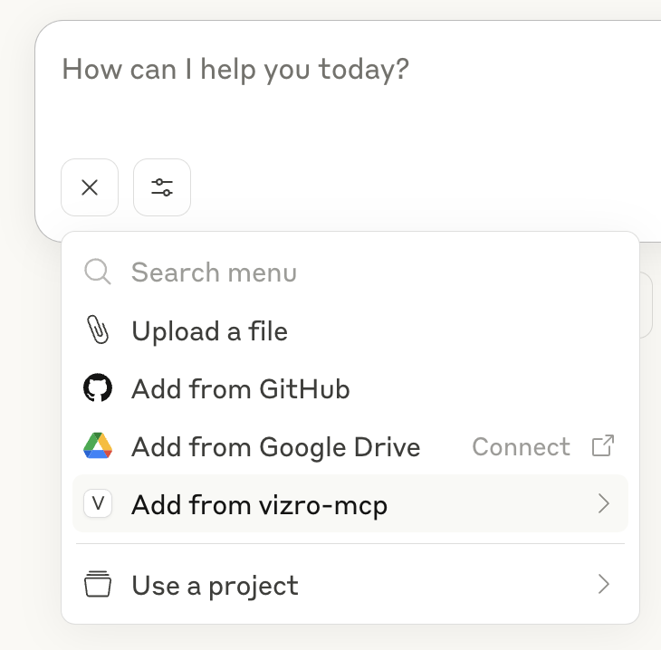
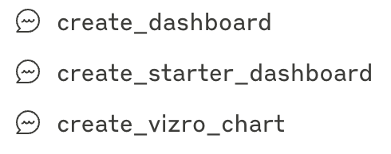

# First dashboard tutorial

Before creating your first Vizro dashboard with Vizro-MCP, you need to configure your MCP host. Follow our instructions to [set up Claude Desktop](../guides/set-up-vizro-mcp-with-claude.md), which is what this tutorial assumes.

(Alternatively, you can [set up Cursor](../guides/set-up-vizro-mcp-with-cursor.md), or [set up VS Code](../guides/set-up-vizro-mcp-with-vscode.md), or use our [basic setup configuration](../guides/set-up-vizro-mcp-basics.md) for your preferred LLM).

When Claude Desktop is set up to use Vizro-MCP, you should see the vizro-mcp menu in the settings/context menu:


## Create a dashboard with a prompt template

Click on the plus icon below the chat, and choose _`Add from vizro-mcp`_.



Choose the template `create_starter_dashboard` and submit the prompt.



The template prompt creates a simple dashboard with one page, one chart, and one filter.

## Create a dashboard with a typed prompt

Prompt templates are only available in Claude Desktop, so if you are using another MCP host, or prefer to type your own prompt, this text is the equivalent of the template:

!!! information "Dashboard creation prompt"

    ```{ .text .copy }
    Create a Vizro dashboard to analyze the iris dataset.
    Make a scatter plot of sepal dimensions and a species filter.
    Use the dark theme.
    ```

## Dashboard output

Given the `create_starter_dashboard.txt` template, or prompt above, Vizro-MCP plans the dashboard, accesses the public Iris dataset, and creates the configuration automatically. It generates code similar to the following, and opens a link to display the dashboard in [PyCafe](https://py.cafe/).

If you want to see the dashboard for the code below, click on **☕️ Run and edit this code in Py.Cafe**.

!!! example "First dashboard"

    === "app.py"

        ```{.python pycafe-link}
        ############ Imports ##############
        import vizro.plotly.express as px
        import vizro.models as vm
        from vizro import Vizro
        import pandas as pd
        from vizro.managers import data_manager


        ####### Data Manager Settings #####
        data_manager["iris_data"] = pd.read_csv(
            "https://raw.githubusercontent.com/plotly/datasets/master/iris-id.csv"
        )

        ########### Model code ############
        model = vm.Dashboard(
            pages=[
                vm.Page(
                    components=[
                        vm.Graph(
                            id="scatter_plot",
                            type="graph",
                            figure=px.scatter(
                                data_frame="iris_data",
                                x="sepal_length",
                                y="sepal_width",
                                color="species",
                                hover_data=["petal_length", "petal_width"],
                            ),
                            title="Sepal Dimensions by Species",
                        )
                    ],
                    title="Iris Data Analysis",
                    controls=[
                        vm.Filter(
                            id="species_filter",
                            type="filter",
                            column="species",
                            targets=["scatter_plot"],
                            selector=vm.Dropdown(type="dropdown", multi=True),
                        )
                    ],
                )
            ],
            theme="vizro_dark",
            title="Iris Dashboard",
        )

        Vizro().build(model).run()

        ```
