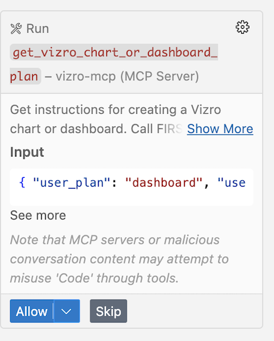
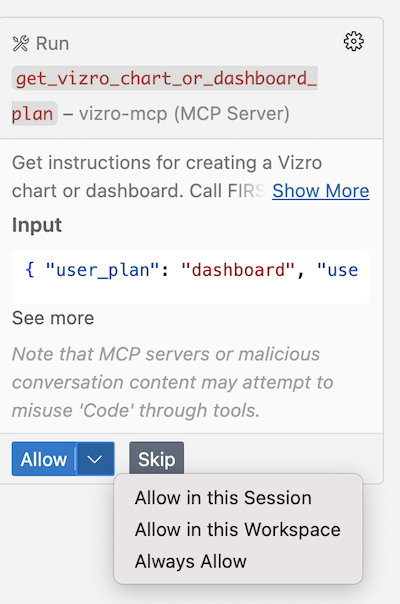
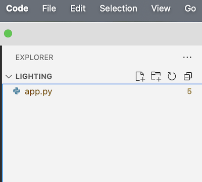

# VS Code and Vizro-MCP

This tutorial shows how to build and share a Vizro dashboard using generative AI. It uses a [public dataset about access to electricity across the globe](https://ourworldindata.org/grapher/share-of-the-population-with-access-to-electricity), but you will not need to download the data. The data is illustrated by a dashboard, and this tutorial shows you how to use Vizro-MCP to create a similar one with Vizro.

The tutorial uses Microsoft VS Code as the MCP host, but if you prefer to use Cursor, you can also follow the instructions since the environments are very similar.

The tutorial uses Vizro-MCP to generate an initial set of Python dashboard code, and a combination of prompting and hand-editing once the code has been generated. The prompts and chart output at the time of writing are shown to illustrate the process. The nature of working with an LLM is that your output may be slightly different.

## Set up Vizro-MCP

If you haven't already done so, follow our instructions to [set up Vizro-MCP to work with VS Code](../guides/set-up-vizro-mcp-with-vscode.md), which this tutorial uses. Follow the instructions to [set up Vizro-MCP with Cursor](../guides/set-up-vizro-mcp-with-cursor.md) if you prefer to use that, or use our [basic setup configuration](../guides/set-up-vizro-mcp-basics.md) for your preferred host.

To check that your host is correctly set up to use Vizro-MCP, pass in a prompt:

```text
Can you access Vizro-MCP?
```

You should receive a response similar to the following:

> Yes, I do have access to Vizro-MCP!

> Vizro-MCP provides several capabilities for creating data visualizations and dashboards using Vizro:

> Available Functions:

> - Creating charts and dashboards with guided instructions
> - Loading and analyzing data from various formats (CSV, JSON, Excel, Parquet, etc.)
> - Getting sample data for testing purposes
> - Validating chart configurations and dashboard setups
> - Getting model schemas for Vizro components
> - Working with both simple chart creation and advanced dashboard configurations

> The MCP server appears to be properly connected and functional. Would you like me to help you create a chart or dashboard using Vizro? I can work with your data or use sample datasets to demonstrate the capabilities.

### Set up your environment

To set up your environment in VS Code, first create a Workspace. Select **File > Open Folder…**, create a new folder (e.g., `lighting`), then click **Open**.

Next, open the Chat view and use **Agent mode**. We used Claude Sonnet 4 when writing this tutorial.

<video controls>
<source src="../../../assets/videos/vs-code-tutorial/00-create-workspace.mp4" type="video/mp4">
</video>

## Create a blank dashboard

The first step is to create a blank dashboard with three tabs for the different charts that submit this prompt in chat. Don't worry about the instruction about PyCafe at this point; we will explain its purpose later:

```text
Let’s use Vizro-MCP to generate a blank dashboard with one page and three tabs.
Generate the code and save it to app.py in the workspace. Don’t open in PyCafe.
```

You can see the prompt submission and processing in the following video.

<video controls>
<source src="../../../assets/videos/vs-code-tutorial/00-prompt-submission.mp4" type="video/mp4">
</video>

When you run the prompt, you may find it stops early in the process because it needs permission to run.



The pause is a security measure to prevent rogue MCP servers from executing code. You can grant permission for Vizro-MCP tools to run as shown. Select Always Allow to avoid being asked for permission each time the prompts run.



You may be asked to grant similar requests for other Vizro-MCP tools before the prompt runs to completion. However, when it does successfully return, it should have created code in `app.py`, visible in the left hand side of the screen in the file browser.



## Run the dashboard

We need to set up a virtual Python environment to run the code, but it's only necessary to do this once, and you can ask VS Code to do it. Once the dashboard is running in the browser, any further code changes will auto-update so you can see them.

Run the dashboard by submitting a prompt such as this:

```text
Use a single command to open a terminal and navigate to the lighting directory.
Activate a uv virtual environment, install vizro and pandas.
Run app.py.
```

??? Tip "Or, run the code manually if you prefer, from within the terminal"

    ```bash
    cd lighting
    uv venv training
    source training/bin/activate
    uv pip install vizro pandas
    python app.py
    ```

To view the dashboard in your browser, follow the dashboard URL shown in the terminal or navigate directly to [http://localhost:8050/](http://localhost:8050/).

The dashboard should look as follows. Note that you can switch between light and dark mode with the toggle switch:

<video controls>
<source src="../../../assets/videos/vs-code-tutorial/01-blank-dashboard.mp4" type="video/mp4">
</video>

## Prompting tips

Here are a few tips to help you prompt Vizro-MCP effectively if the steps above don't yield the same results:

- You can ask Vizro to try the entire prompt again by typing "Clear context" and then, when it has returned, resubmitting your prompt. Or create a new chat by clicking the plus button, and start afresh.

- You can ask Copilot to save checkpoints and restore them to revert code to previous versions. View the [VS Code documentation](https://code.visualstudio.com/docs/copilot/chat/chat-checkpoints) for more details.

- You can pass in the code for a similar project to serve as a guide if the LLM is struggling. For example, if you are working on a Vizro chart, you could pass the equivalent chart from the [Vizro Visual Vocabulary](https://huggingface.co/spaces/vizro/demo-visual-vocabulary).

## Add charts with prompts

You will now add three charts to the dashboard to replicate those of the [original visualization](https://ourworldindata.org/grapher/share-of-the-population-with-access-to-electricity).

### 1. Add a choropleth map

Submit a prompt like this:

```text
Use data from https://ourworldindata.org/grapher/share-of-the-population-with-access-to-electricity?overlay=download-data.
Edit the code in app.py.
For the first tab, add a choropleth map for the share of the
population with electricity in 2023.
Use Vizro to create the chart and include a legend with a color gradient.
Use the Vizro design system and Vizro colors.
Ensure the chart fits the viewport. Use the Vizro light theme.
```

After some processing, Vizro-MCP updates the code in `app.py` with the chart code needed to draw the map requested. You should see that the dashboard in your browser has updated. If you closed the tab for any reason, you can open a new tab and navigate to [http://localhost:8050/](http://localhost:8050/) to view the dashboard.

The video shows the chart created in light mode:

<video controls>
<source src="../../../assets/videos/vs-code-tutorial/02-first-chart-first-run.mp4" type="video/mp4">
</video>

#### Add a year slider

The next step is to add a [filter](https://vizro.readthedocs.io/en/stable/pages/user-guides/filters/) to the chart to enable the user to change the year shown. To iterate the code and adjust the filter, submit the following prompt:

```text
Use Vizro functionality to add a slider to the first tab
which works as a selector.
The user can select the year for which the data is shown on the choropleth.
Use a range slider with range from 1990 to 2023.
As the slider is moved, update the graphic with
the Access to electricity (% of population) for each year.
Use only the Vizro design system, features and functionality.
```

As usual, your results may vary, but from our submission, the chart had a slider filter that looked strange because it had a mark and label for every year of data available.

If this happens as you work through the same steps, you can ask Vizro-MCP via a prompt to make a change, by suggesting that it adds marks in steps of 5 years only. If you have some familiarity with coding, you may just want to tweak the filter code in `app.py` by hand to add a line to customize the slider marks. Add the following line of code:

```python
marks = ({year: str(year) for year in range(1990, 2024, 5)},)
```

<video controls>
<source src="../../../assets/videos/vs-code-tutorial/03-first-chart-with-slider.mp4" type="video/mp4">
</video>

#### Add animation and projection selector

There are some further enhancements possible to produce a chart similar to that on the [Our World in Data website](https://ourworldindata.org/grapher/share-of-the-population-with-access-to-electricity), such as addition of a 3D view on the map and an animation to update the chart in a timelapse progression. To modify and improve the chart, submit the following prompt.

```text
Add animation by year to the choropleth map.
Replace the year slider with a projection selector
so users can switch between flat and 3D globe views.
```

We have our first chart and it's looking pretty good! Next, you'll add a chart to the second tab.

<video controls>
<source src="../../../assets/videos/vs-code-tutorial/04-first-chart-complete.mp4" type="video/mp4">
</video>

!!! tip "Any problems?"

    There are times when gen AI fails to generate the code you'd expect. Don't worry if this happens. You can type "Clear context" as a prompt and try again, or just open a new chat window.

    If the LLM still seems to be having issues, you can drop in some code alongside the prompt and suggest it uses the code for guidance. The complete code for the project is found at the bottom of this tutorial for you to copy. You can prompt Vizro-MCP to use it to help the LLM get started.

### 2. Add a line chart

The next step is to add a second chart, a line chart for seven countries to show access across the time period of the data.

Submit the following prompt:

```text
Let's work on the second tab.
Add a line chart for 7 chosen Entity countries:
(United States, China, Brazil, India, Afghanistan, Rwanda and Haiti).
The x axis is Year and the y axis is Access to electricity (% of population).
Use Vizro's design system to color each line a different color.
Add a label to each of the lines for the country it represents.
Add a checklist selector which lists every country in the dataset
so the user can add or remove a country from the  plots.
Use Vizro's design system, features and functionality.
```

The output you receive will vary, but may look something like this:

<video controls>
<source src="../../../assets/videos/vs-code-tutorial/05-second-chart-first-run.mp4" type="video/mp4">
</video>

It is clear from the video that the user experience of the chart isn't wonderful. If the user wants to remove one of the countries selected, they have to scroll through the full list to find the country.

One way to improve it is to ask Vizro-MCP how best to improve the usability, which is what we did in a prompt. It came up with a few suggestions, and recommended the best option to be a dropdown filter, so that the countries shown on the line graph are grouped together and are easy to remove and replace.

Vizro-MCP supplied the code as shown below, which makes it very easy to make the change manually. The code is below if you want to make the change directly. Or you can ask Vizro-MCP to change the code for you. The chart with the new filter is shown below in the video.

```python
(
    vm.Filter(
        column="Entity",
        targets=["electricity_trends", "electricity_histogram"],
        selector=vm.Dropdown(
            multi=True,
            value=["United States", "China", "Brazil", "India", "Afghanistan", "Rwanda", "Haiti"],
            title="Select countries to display",
            extra={"optionHeight": 35},
        ),
    ),
)
```

<video controls>
<source src="../../../assets/videos/vs-code-tutorial/06-second-chart-complete.mp4" type="video/mp4">
</video>

### 3. Add an animated histogram

The final chart is an animated histogram for the same seven countries selected for the line chart.

Use the following prompt:

```text
Add a third tab with an animated horizontal bar chart showing
electricity access by country.
Share the country filter with tab 2 so users can
switch between line and bar views of the same data.
Remove the legend since country names are on the y-axis.
Ensure all selected countries appear in every animation frame,
filling missing years with interpolated data.
```

You may need to iterate the chart further, for example to make it fit viewport.

<video controls>
<source src="../../../assets/videos/vs-code-tutorial/07-final-dashboard.mp4" type="video/mp4">
</video>

We have a dashboard with three tabs and three charts. In the next step, you'll learn how to share the project with other users.

## Share your dashboard using PyCafe

The easiest way to share your dashboard is to use [PyCafe](https://py.cafe), which meansyou can email a standard link to others, who just open it in their browser to view and interact with the dashboard. You can choose to share either just the dashboard, or give access to the code too.

1. Create a free account at [PyCafe](https://py.cafe).
1. Create a new Vizro project.
1. Replace default code with the code in your `app.py`.
1. Push project to share and get a link.

Use only public data for PyCafe (public site).

<video controls>
<source src="../../../assets/videos/vs-code-tutorial/08-share-with-pycafe.mp4" type="video/mp4">
</video>

## Summary

In this tutorial, you learned how to:

- Generate a dashboard and charts using prompts.
- Iterate visualizations and filters using prompts and manually by adjusting code.
- Share the project via PyCafe.

## Code

The code for the dashboard, generated by Vizro-MCP in VS Code using Claude Sonnet 4, is below:

??? example "The final code for the completed dashboard"

    === "app.py"

    ```{.python pycafe-link}
    ############ Imports ##############
    import vizro.plotly.express as px
    import vizro.models as vm
    from vizro import Vizro
    import pandas as pd
    from vizro.managers import data_manager


    ####### Data Manager Settings #####
    # Load electricity access data
    electricity_data = pd.read_csv(
        "https://ourworldindata.org/grapher/share-of-the-population-with-access-to-electricity.csv"
    )
    # Sort by year to ensure proper animation direction (left to right = 1990 to 2023)
    electricity_data = electricity_data.sort_values('Year')

    # Get all countries that have some data and expand them to cover full year range
    # This ensures any country selected in the filter will show properly in animations
    all_countries = electricity_data['Entity'].unique()
    all_years = list(range(1990, 2024))

    # Create expanded data for ALL countries to support dynamic filtering
    expanded_data = []
    for country in all_countries:
        country_data = electricity_data[electricity_data['Entity'] == country].copy()
        if not country_data.empty:
            # Get the country code
            country_code = country_data['Code'].iloc[0] if 'Code' in country_data.columns else ''

            # Create base structure for all years
            for year in all_years:
                existing = country_data[country_data['Year'] == year]
                if not existing.empty:
                    expanded_data.append(existing.iloc[0].to_dict())
                else:
                    # Find the most recent data before this year, or earliest after
                    before_data = country_data[country_data['Year'] < year]
                    after_data = country_data[country_data['Year'] > year]

                    if not before_data.empty:
                        # Use most recent data before this year (forward fill)
                        base_data = before_data.iloc[-1].to_dict()
                    elif not after_data.empty:
                        # Use earliest data after this year (backward fill)
                        base_data = after_data.iloc[0].to_dict()
                    else:
                        continue

                    # Create new entry with interpolated year
                    base_data['Year'] = year
                    expanded_data.append(base_data)

    # Convert to DataFrame
    final_data = pd.DataFrame(expanded_data).sort_values(['Entity', 'Year'])
    data_manager["electricity_data"] = final_data

    ########### Model code ############
    model = vm.Dashboard(
        pages=[
            vm.Page(
                components=[
                    vm.Tabs(
                        type="tabs",
                        tabs=[
                            vm.Container(
                                type="container",
                                components=[
                                    vm.Graph(
                                        id="electricity_map",
                                        figure=px.choropleth(
                                            data_frame="electricity_data",
                                            locations="Code",
                                            color="Access to electricity (% of population)",
                                            hover_name="Entity",
                                            hover_data={
                                                "Access to electricity (% of population)": ":.1f%",
                                                "Code": False,
                                                "Year": False,
                                            },
                                            animation_frame="Year",
                                            animation_group="Entity",
                                            labels={
                                                "Access to electricity (% of population)": "Access to Electricity (%)"
                                            },
                                            range_color=[0, 100],
                                            height=700,
                                        ),
                                    )
                                ],
                                title="Global electricity access",
                                layout=vm.Flex(type="flex"),
                            ),
                            vm.Container(
                                type="container",
                                components=[
                                    vm.Graph(
                                        id="electricity_trends",
                                        figure=px.line(
                                            data_frame="electricity_data",
                                            x="Year",
                                            y="Access to electricity (% of population)",
                                            color="Entity",
                                            labels={
                                                "Access to electricity (% of population)": "Access to Electricity (%)"
                                            },
                                            height=600,
                                        ),
                                        title="Electricity access trends by country",
                                    )
                                ],
                                title="Country trends",
                                layout=vm.Flex(type="flex"),
                            ),
                            vm.Container(
                                type="container",
                                components=[
                                    vm.Graph(
                                        id="electricity_histogram",
                                        figure=px.bar(
                                            data_frame="electricity_data",
                                            x="Access to electricity (% of population)",
                                            y="Entity",
                                            orientation="h",
                                            animation_frame="Year",
                                            animation_group="Entity",
                                            labels={
                                                "Access to electricity (% of population)": "Access to Electricity (%)"
                                            },
                                            range_x=[0, 100],
                                            height=700,
                                        ).update_layout(showlegend=False),
                                        title="Electricity access by country",
                                    )
                                ],
                                title="Country comparison",
                                layout=vm.Flex(type="flex"),
                            ),
                        ],
                        title="",
                    )
                ],
                title="Electricity access dashboard",
                layout=vm.Flex(type="flex"),
                controls=[
                    vm.Parameter(
                        targets=["electricity_map.projection"],
                        selector=vm.RadioItems(
                            options=["natural earth", "orthographic"],
                            value="natural earth",
                            title="Map projection",
                        ),
                    ),
                    vm.Filter(
                        column="Entity",
                        targets=["electricity_trends", "electricity_histogram"],
                        selector=vm.Dropdown(
                            multi=True,
                            value=[
                                "United States",
                                "China",
                                "Brazil",
                                "India",
                                "Afghanistan",
                                "Rwanda",
                                "Haiti",
                            ],
                            title="Select countries to display",
                            extra={"optionHeight": 35},
                        ),
                    ),
                ],
            )
        ],
        theme="vizro_light",
    )

    app = Vizro().build(model)
    if __name__ == "__main__":
        app.run(debug=True, port=8050)

    ```
